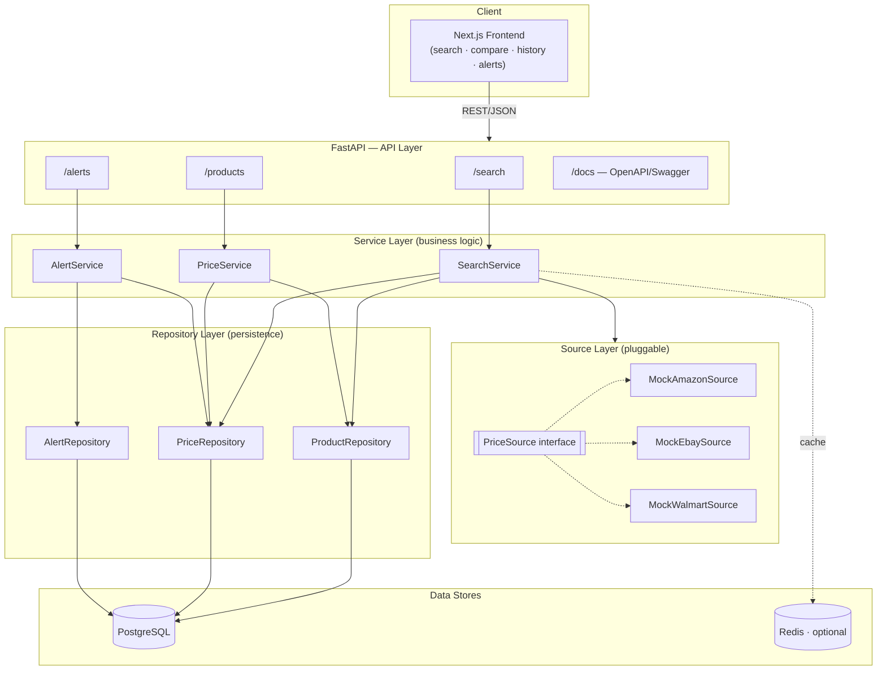

# MyDealFinder — Vision

MyDealFinder is a modern price search engine. Users search for a product by keyword,
and the platform aggregates offers from multiple sources, compares prices side by side,
tracks how prices evolve over time, and notifies users when a product drops below a
price they care about.

---

## 1. Project Goal & Target Audience

**Goal:** Help people pay less. Give shoppers a single place to search a product, see
who sells it cheapest *right now*, understand whether the current price is actually a
good deal (price history), and get alerted automatically when the price drops.

**Target audience:**

- **Deal-hunters / bargain shoppers** who compare prices across shops before buying.
- **Patient buyers** who are willing to wait for a price to drop and want to be told when.
- **Resellers / small businesses** tracking the price of goods they buy regularly.

**Non-goals (for the MVP):** real-time scraping of live retailers, user accounts/auth,
payment, and a recommendation engine. These are explicitly future work so the MVP stays
small and demonstrably working.

---

## 2. Tech Stack & Reasoning

| Layer | Choice | Why |
|---|---|---|
| **Backend** | **Python 3.12 + FastAPI** | Async, high performance, and first-class **OpenAPI/Swagger** generation out of the box (a hard requirement). Pydantic gives typed, validated request/response models for free. Huge ecosystem for the scraping work the roadmap implies. |
| **ORM / DB access** | **SQLAlchemy 2.0 (async) + Alembic-ready models** | Mature, explicit, supports both Postgres (prod) and SQLite (tests/dev) with one codebase — avoids vendor lock-in. |
| **Database** | **PostgreSQL 16** (prod), **SQLite** (unit tests) | Postgres is a robust, cloud-agnostic open-source RDBMS. SQLite keeps unit tests fast and dependency-free. |
| **Caching** | **Redis 7** (optional, wired via docker-compose) | Used to cache hot search results and as a future task/queue broker. The app degrades gracefully when Redis is absent, so it is not a hard dependency for the MVP. |
| **Frontend** | **Next.js 14 (App Router) + React + TypeScript** | Reactive, file-based routing, server components, and an excellent DX. TypeScript keeps the API contract honest. |
| **Containerization** | **Docker + docker-compose** | `docker compose up` brings up Postgres, Redis, the API, and the web app together. No cloud-specific services → **no vendor lock-in**. |
| **Testing** | **pytest** | Concise, powerful fixtures; the de-facto standard for Python. |

**Why not .NET / Node for the backend?** Both are fine choices. FastAPI was picked because
its automatic OpenAPI docs, Pydantic validation, and Python's scraping ecosystem
(`httpx`, `beautifulsoup4`, `playwright`) line up directly with this project's roadmap —
the thing we'll spend the most future effort on is data ingestion.

---

## 3. Core Features (MVP)

1. **Product search** — search by keyword; returns aggregated products with their best price.
2. **Price comparison** — for a product, show every source's price side by side, sorted cheapest-first.
3. **Price history** — per product/source time series of observed prices, so users see trends.
4. **Price alerts** — register an email + threshold; alerts trigger when the best price drops below it.
5. **Source aggregation** — 3 pluggable mock sources (Amazon-like, eBay-like, Walmart-like) behind a common interface, so a real scraper can be dropped in later without touching the rest of the app.

---

## 4. Architecture Overview

The backend follows a **clean, layered architecture**. Dependencies point inward:
API → Services (business logic) → Repositories (persistence) → Database. Data **sources**
are an independent, pluggable layer the services orchestrate.

**Layer responsibilities**

- **API layer** — HTTP concerns only: routing, validation (Pydantic), serialization, status codes, Swagger.
- **Service layer** — all business rules: aggregating sources, computing best prices, recording history, evaluating alerts. Has no knowledge of HTTP or SQL.
- **Source layer** — each source implements one `PriceSource` interface (`search(keyword)`). Swapping a mock for a real scraper is a one-class change.
- **Repository layer** — the only place that talks SQL. Services depend on repository abstractions, not the DB.

---

## 5. Future Roadmap

**Near term**
- Real scrapers (httpx + BeautifulSoup / Playwright) behind the existing `PriceSource` interface.
- Background scheduler (Celery/APScheduler) to refresh prices and evaluate alerts on a cron.
- Real email/push delivery for alerts (SMTP / SendGrid / web push).

**Mid term**
- User accounts, saved searches, and a watchlist.
- Redis-backed search caching + rate limiting.
- Currency normalization and shipping-cost-aware "true price".

**Long term**
- "Is this a good deal?" scoring from historical distribution.
- Browser extension that overlays MyDealFinder prices on retailer pages.
- Public API + webhooks for third parties.
